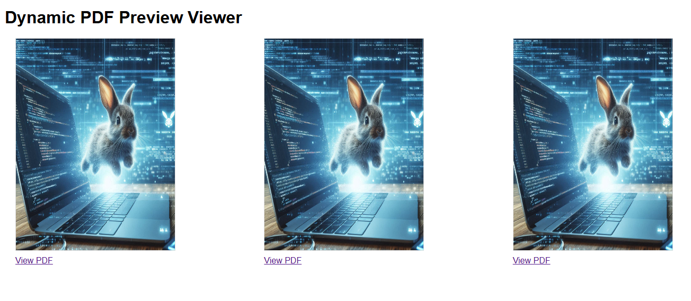

# |Utilities 📦| PDF Display Preview Dynamic Component 📄

> Dynamic PDF Viewer | A component that allows you to display a preview of Dynamically Build PDFs on Your Website 📦



Powered by __PDF.js__: [PDF.js](https://mozilla.github.io/pdf.js/)

## Getting Started
1. Follow steps in __index.html__, here is the component ✅
2. ⚙ The function ````createComponentPreviewViewPDF```` is used for core of utility.
3. ✏ Change entries for PDFs paths in ````pdfUrls````
4. ⭐ Customize and style for __component-styles.css__!

That's it, the idea is to be able to upload the paths of the PDFs you have and create views of them.

## Using a API?
Additional API support is also included, in __main.js__

Rate a ⭐ if it helped you 😉
